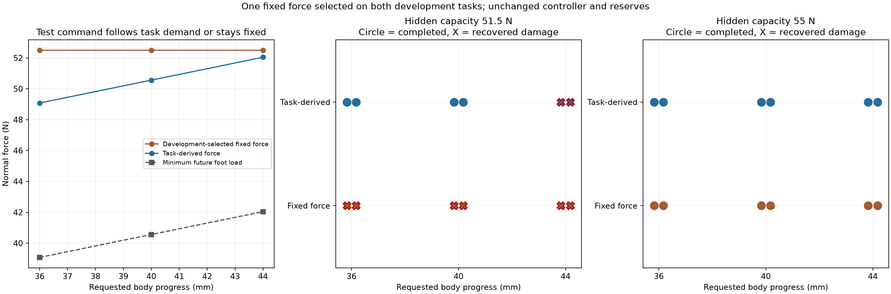

# Task-derived testing versus one calibrated fixed force

The task-derived test completed **10/12 movements**, compared with **6/12**
for one fixed **52.5 N** test selected on development. It damaged **2/12 pads**
versus **6/12**; all eight damaged trials recovered to the original supporting
tripod. Four matched pairs completed intact under task-derived testing where
the fixed test damaged the pad. All 24 predeclared trials finished.

| Policy | Completed movement | Damaged pad | Controlled recovery | Safe stop / unsafe / invalid |
| --- | ---: | ---: | ---: | ---: |
| Development-selected fixed 52.5 N | 6/12 | 6/12 | 6/12 | 0 / 0 / 0 |
| Task-derived sufficient test | 10/12 | 2/12 | 2/12 | 0 / 0 / 0 |

Damage and recovery overlap. Recovery preserves the robot's stable support;
it does not repair the pad or count as completing the movement.

This addresses the previous experiment's one-task limitation: a smaller constant
could have explained its improvement over near-maximum testing. Here the fixed
policy is calibrated across a **wider task range** than evaluation, and both
policies retain the same body/load optimizer, movement freedoms, permitted
probing-posture changes, controller, sensing, reserves, and recovery. Neither
receives hidden pad strength. The existing 48-trial V2 and 32-trial
probe-efficiency studies remain unchanged.

The [complete comparison](../../results/weak_pad/task_probe/comparison/report.md),
[machine-readable records](../../results/weak_pad/task_probe/comparison/comparison.json),
and [independent raw audit](../../results/weak_pad/task_probe/validation/independent_execution_audit.json)
retain every outcome. The [experiment guide](../task_probe.md) gives the method
and reproduction command.

## Selecting the fixed force before evaluation

Development tested each of **50.57, 52.5, and 53 N** on both **34 mm and 45 mm**
forward tasks, using the known B stance, a 62 N pad, and seed 101. The declared
rule selected the lowest candidate completing both tasks without damage.

| Candidate command | 34 mm task | 45 mm task |
| --- | --- | --- |
| 50.57 N | Completed intact | Safe stop |
| 52.5 N | Completed intact | Completed intact |
| 53 N | Completed intact | Completed intact |

The resulting **52.5 N scalar** is identical across all formal tasks,
capacities, and seeds. Selection and execution sources were frozen before
evaluation. An [independent development audit](../../results/weak_pad/task_probe/validation/development_selection_raw_audit.json)
reconstructs this choice from measured task completion and load evidence in all
six native attempts. The nominal task-derived development replay also matches
its preserved predecessor across 104 shared signals.

This is the lowest successful **tested candidate**, not a global search over
all constants. Other candidate grids or calibration objectives could yield a
different tradeoff; a policy allowed to sacrifice one development task could
select a lower scalar.

## Different task demands, identical initial support

Formal evaluation uses forward goals **36, 40, and 44 mm**, hidden capacities
**51.5 and 55 N**, and new sensing seeds **311 and 1201**. FR is the next lifted
leg. Tasks interpolate inside the development range; the B geometry is known
and 40 mm is the nominal-demand control. The six physical task/capacity
combinations and both seeds are new.

Each cell below contains both seeds:

| Task | Hidden capacity | Fixed 52.5 N | Task-derived test |
| --- | ---: | --- | --- |
| 36 mm | 51.5 N | 2 damaged, recovered | 2 completed intact |
| 36 mm | 55 N | 2 completed intact | 2 completed intact |
| 40 mm | 51.5 N | 2 damaged, recovered | 2 completed intact |
| 40 mm | 55 N | 2 completed intact | 2 completed intact |
| 44 mm | 51.5 N | 2 damaged, recovered | 2 damaged, recovered |
| 44 mm | 55 N | 2 completed intact | 2 completed intact |

The force needed by the future movement changes with the task. The common
initial 12 N test remains. Task-derived additional testing uses these quantities,
computed from the observed initial probing stance:

| Task | Minimum future FL load | Required measured plateau | Selected task-derived command | Physical test peak on intact trials |
| --- | ---: | ---: | ---: | ---: |
| 36 mm | 39.074–39.083 N | 48.075–48.084 N | 49.075–49.084 N | 49.512–49.521 N |
| 40 mm | 40.556–40.565 N | 49.557–49.566 N | 50.557–50.566 N | 51.042–51.052 N |
| 44 mm | 42.039–42.048 N | 51.040–51.049 N | 52.040–52.049 N | 52.576–52.586 N |

The required plateau adds the unchanged **1 N sensing reserve, 8 N tracking
reserve, and 0.001 N numerical tolerance** to the future load. The command then
adds the declared **0.8 N sensor-error bound and 0.2 N empirical undershoot
allowance**. Those allowances select a command; only a fresh qualifying
measured hold creates a certificate. The fixed policy commands 52.5 N for every
task and reaches 53.052–53.053 N physically on intact trials.

The figure separates the future required load, selected test command, and
capacity-specific outcomes. Seed markers are offset by ±0.175 mm for visibility;
the actual declared tasks remain exactly 36, 40, and 44 mm.

The **44 mm / 51.5 N failures remain an important limit**. That capacity exceeds
both the approximately 42.04 N minimum future load and the 51.04 N required
measured plateau. The task-derived command, including allowances, is already
52.04–52.05 N; the intact 55 N control shows physical peaks another approximately
0.54 N above it. Both weaker-pad attempts therefore fail during probing.
These records do not establish that the movement itself intrinsically requires
more than 51.5 N, or that gentler testing could never succeed. A command is not
a physical force cap, and this method is not globally minimal testing.

## Meaningful movement and the paired replay

Success requires terminal measured progress of at least the declared goal minus
**1 mm**, plus at least **one second** of simultaneous task-specific forward
progress, at least **20 mm measured FR lift**, and valid supporting contacts
and certificate. Progress is relative to the **first probing position**; a
later probe cannot reset it. Every completed trial holds the simultaneous task
condition for **3.122–3.124 s**.

| Task | Fixed policy terminal forward progress | Task-derived terminal forward progress | Task-derived future physical peak |
| --- | ---: | ---: | ---: |
| 36 mm | 36.024 mm | 36.427–36.558 mm | 39.469–39.502 N |
| 40 mm | 39.907–39.908 mm | 40.012–40.019 mm | 40.843–40.850 N |
| 44 mm | 43.790 mm | 43.839–43.843 mm | 42.189–42.203 N |

Progress values are the final 0.1 s mean of intact completed recordings. Their
maximum measured FR clearance is 29.643–29.726 mm. Neither light contact alone
nor remaining on the original tripod is counted as completing the task.

The preselected **36 mm / 51.5 N / seed 311** pair makes the difference visible.
The fixed policy requests 52.5 N and damages the pad during the ramp. The
task-derived policy requests 49.084 N, reaches 49.521 N physically, and obtains
a 47.507 N measured certificate after the sensing reserve. Its future physical
load peaks at 39.469 N while it advances and lifts FR.

[Watch the synchronized replay](../../results/weak_pad/task_probe/media/progress36_capacity51p5_paired_seed311.mp4)
or inspect the [preview and replay provenance](../../results/weak_pad/task_probe/media/README.md).
The videos restore recorded states, without rerunning control. Overlays show
actual target-pad force, measured plateau target, selected command, certificate,
installed cap, and first-probe-relative progress. The shorter completed record
is held on its final frame with an explicit label.

## Timing, physical force, and recovery

There is **no probing-time improvement**. Among the six matched pairs where
both policies complete intact, active ramp/hold time is **12.004 s for both**.
Including testing-posture changes and release, task-derived testing takes
**0.074 s longer** at 36 mm, **0.034 s longer** at 40 mm, and **0.006 s longer**
at 44 mm. Total trial time differences range from **0.106 s faster to 0.070 s
slower**, without a consistent advantage.

Failed tests terminate early; their shorter test time is not faster successful
testing. All eight damaged trials enter controlled unloading and lift FL,
spend **5.104 s** in recovery phases, and establish at least **3.350 s** of
stable support on the original tripod. None attempts the future FR lift after
pad failure.

Physical future load exceeds the installed MPC cap by up to **0.031 N** in this
study, while remaining inside the measured certificate. During certified probe
release or posture changes, the largest actual-minus-cap gap is **6.533 N**.
The unchanged empirical **8 N reserve** covers these recordings. It is not a
validated universal tracking bound, and the 0.2 N targeting allowance is also
empirical.

## Validation and scope

The [combined suite passes 597 tests](../../results/weak_pad/task_probe/validation/final_tests.json).
All nine deliberate task/proof/force/reserve/damage falsifications are rejected
by the [additional validator audit](../../results/weak_pad/task_probe/validation/task_probe_analyzer_mutations.json),
with the original raw recordings unchanged. The new task-specific checks are
additional to the preserved V2 acceptance criteria.

The [independent raw audit](../../results/weak_pad/task_probe/validation/independent_execution_audit.json)
verifies all 24 formal and six development records, reconstructs the task-load
equilibrium LP separately from the execution planner, and independently
reselects the single 52.5 N constant. It checks measured proof, continuous
certificate monitoring, physical failure and displacement, MPC cadence,
actual loads, task-specific progress, and recovery. For each seed, all tasks,
capacities, and policies have identical initial body/foot/contact/sensing/proof
signals through the first decision at 30.226 or 30.252 s.

The [preservation and conformance audit](../../results/weak_pad/task_probe/validation/frozen_comparison_verification.json)
checks old evidence hashes, both unchanged and additional analyzer results,
matched policy inputs, the development selection, and capacity-blind control
prefixes. The [nominal behavior comparison](../../results/weak_pad/task_probe/validation/frozen_task_behavior_equivalence.json)
retains the task-derived planner's prior recorded behavior.

These are prescribed simulator cases using one known stance, two bounded-noise
seeds, and one next-leg choice. Capacities share behavior until physical failure;
the 24 cells are not independent samples of a terrain population. The result
supports task-dependent testing over this development-selected constant on
these conditions. It does not establish optimal testing, hardware safety,
or a new algorithmic contribution. Both policies use conventional optimization,
without PRIMP. The earlier four failures on 29 N and 34 N pads remain unchanged
and are not claimed to be prevented by this extension.
