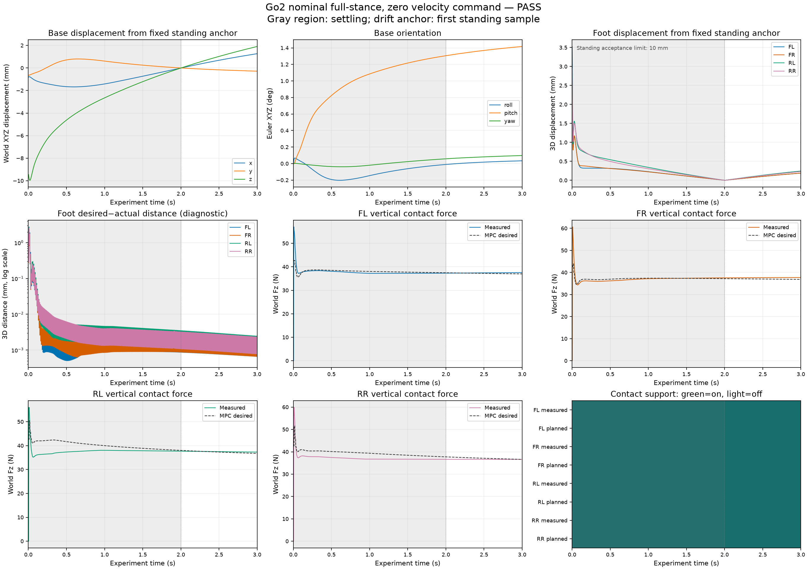

# Go2 zero-command standing experiment — PASS

Robot `go2`, controller `nominal`. Recorded 1500 intervals at 0.002 s; 3 s total, including 2 s settling and 1 s evaluated standing.

Acceptance limits were chosen for this flat-ground experiment. They are not paper guarantees. All raw startup samples remain in `signals.npz`; motion/contact criteria use only the standing phase.

Rows are interval endpoints, with no initial t=0 row. Body and foot drift use a fixed anchor at the first standing sample, t=2.002 s. Coordinates are world-frame meters, orientation is Euler XYZ, and angular velocity is expressed in the base frame.

| Check | Result | Requirement | Observed |
|---|---|---|---|
| completed | PASS | Runner status is completed | completed |
| sample_count | PASS | Exactly 1500 integration intervals | 1500 |
| total_duration | PASS | Final experiment time 3 s | 3 |
| time_grid | PASS | End-of-interval times on 0.002 s grid, no reset or gap | 1500 |
| control_state_alignment | PASS | Control timestamp is the start of its recorded state interval (time_s - dt) | 2.2204e-16 |
| mujoco_clock | PASS | Raw MuJoCo clock advances one dt per sample without reset | 0.002 |
| standing_duration | PASS | Exactly 1 s / 500 standing intervals after settling | 1 |
| finite_data | PASS | Every numeric raw array is finite | [] |
| zero_velocity_command | PASS | All linear and angular command components <= 1e-12 in magnitude | [0.0, 0.0] |
| no_termination | PASS | No terminated or truncated sample | [0, 0] |
| no_numerical_warnings | PASS | No MuJoCo numerical warnings | 0 |
| planned_full_stance | PASS | All four scheduled support flags true throughout | 0 |
| measured_full_stance | PASS | Every foot has an active contact at every standing sample | {"FL": 0, "FR": 0, "RL": 0, "RR": 0} |
| mpc_update_cadence | PASS | 300 MPC updates at 100 Hz; every 5 intervals starting at control t=0 | 300 |
| qp_success | PASS | QP status 0 at every MPC update | {"0": 300} |
| nlp_status | PASS | NLP status 0 or 2 at every MPC update | {"2": 300} |
| max_abs_roll_pitch_deg | PASS | Standing max_abs_roll_pitch_deg <= 5 | 1.4167 |
| max_xy_drift_m | PASS | Standing max_xy_drift_m <= 0.02 | 0.0012974 |
| height_range_m | PASS | Standing height_range_m <= 0.02 | 0.0019036 |
| rms_linear_speed_m_s | PASS | Standing rms_linear_speed_m_s <= 0.03 | 0.002319 |
| rms_angular_speed_rad_s | PASS | Standing rms_angular_speed_rad_s <= 0.05 | 0.0022415 |
| max_foot_displacement_m | PASS | Standing max_foot_displacement_m <= 0.01 | 0.00024545 |

MPC updates: 300; NLP statuses: `{'2': 300}`; QP statuses: `{'0': 300}`. Status 2 is the configured SQP iteration budget being reached. QP success is checked independently; full NLP convergence is not claimed.

Model weight: 149.17 N. Mean measured vertical support during standing: 149.17 N (0.99995 × model weight). Maximum commanded actuator torque: 8.5823 N·m; clipped actuator samples: 0.

| Foot | Standing contact | Max fixed-anchor drift (m) | RMS desired−actual distance (m) | Mean measured / desired Fz (N) |
|---|---:|---:|---:|---:|
| FL | 1 | 0.00019 | 1.6218e-06 | 37.426 / 37.217 |
| FR | 1 | 0.00019105 | 1.6314e-06 | 37.652 / 37.024 |
| RL | 1 | 0.00024545 | 2.1004e-06 | 37.481 / 37.321 |
| RR | 1 | 0.00022993 | 1.9665e-06 | 36.609 / 37.127 |

Desired and foothold-reference errors are diagnostics. Full-stance desired positions can copy sensed feet, so small errors do not demonstrate independent stance-trajectory tracking.

No commanded base-height signal is part of this dataset. The height criterion measures variation, not absolute reference tracking; the upstream terrain estimator uses foot-center heights, so a world-z comparison against nominal hip height alone would be misleading.

Raw signals: `signals.npz`. Configuration and provenance: `metadata.json`. Machine-readable criteria and metrics: `summary.json`.
