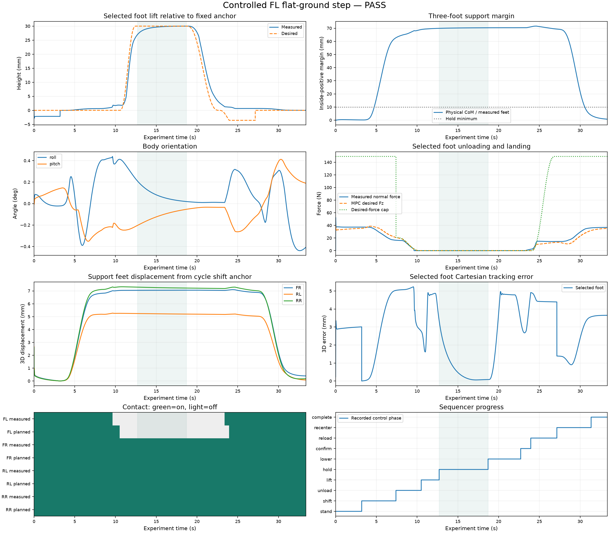

# Controlled FL foot step — PASS

Completed 1 of 1 requested cycles. Each commanded lift is 30 mm with a 6 s hold. Recorded 33.348 s at 0.002 s per interval.

Predeclared engineering limits for this controlled flat-ground simulation; not a stability proof.

| Check | Result | Requirement | Observed |
|---|---|---|---|
| completed | PASS | Completed status and exactly 1 completed cycles | {"status": "completed", "completed_cycles": 1} |
| cycle_labels | PASS | Every requested cycle appears in chronological order | [1] |
| sample_clock | PASS | Continuous end-of-interval sampling with no reset or time gap | {"rows": 16674, "last_time_s": 33.34799999999479} |
| control_alignment | PASS | Control timestamp equals interval endpoint minus dt | 2.444225377651321e-15 |
| finite_data | PASS | All recorded numerical signals finite | [] |
| no_termination | PASS | No termination or truncation | 0 |
| no_numerical_warnings | PASS | No MuJoCo numerical warnings | 0.0 |
| no_torque_saturation | PASS | No actuator command clipping | 0 |
| qp_success | PASS | Every MPC update has QP status 0 | {"0": 3337} |
| nlp_status | PASS | Post-settling MPC NLP status is 0 or 2 | {"2": 3037} |
| selected_force_cap | PASS | Desired selected-foot vertical force <= configured cap + 1 N at MPC updates | -0.0 |
| body_tilt | PASS | Maximum absolute roll or pitch < 8 degrees | 0.43929146621801957 |
| cycle_1_phase_order | PASS | All stages occur once in stand→shift→unload→lift→hold→lower→confirm→reload→recenter order | ["stand", "shift", "unload", "lift", "hold", "lower", "confirm", "reload", "recenter", "complete"] |
| cycle_1_hold_duration | PASS | Continuous hold >= 6 s with at most one sample of boundary tolerance | 6.0 |
| cycle_1_hold_contact | PASS | Selected foot has neither contact nor planned support; other three have both for every hold sample | {"selected_measured_samples": 0, "selected_planned_samples": 0, "missing_support_measured_samples": 0, "missing_support_planned_samples": 0} |
| cycle_1_hold_clearance | PASS | Selected foot remains >= 20 mm above its fixed pre-lift center height throughout hold | 0.027016910911158834 |
| cycle_1_support_margin | PASS | Physical CoM projection has >= 10 mm margin inside measured three-foot support triangle during hold | {"independent_minimum_m": 0.06992759409047483, "logged_minimum_m": 0.06992759409047483} |
| cycle_1_fixed_lift_reference | PASS | Immutable lift anchor and constant hold target 0.03 m above it, with zero desired velocity/acceleration | true |
| cycle_1_foot_tracking | PASS | Selected-foot 3D error < 12 mm during lift, hold, lower and confirm | 0.004970839538036122 |
| cycle_1_support_slip | PASS | All three support feet stay within 10 mm of their fixed positions at shift entry | 0.0073209810733960825 |
| cycle_1_reload_gate | PASS | Reload starts only after confirm phase, measured selected-foot contact and recorded contact debounce >= 0.1 s (>0) | {"time_s": 23.943999999997608, "contact_confirmed": true, "measured_contact": true, "dwell_s": 0.09999999999994458} |
| final_four_foot_stance | PASS | Final complete phase lasts >= 1 s with all four feet in measured and planned contact | 2.0020000000000002 |

| Cycle | Hold (s) | Min clearance (mm) | Min support margin (mm) | Max hold error (mm) | Max support drift (mm) |
|---|---:|---:|---:|---:|---:|
| 1 | 6.000 | 27.017 | 69.928 | 3.353 | 7.321 |

Phase durations and landing-force peaks for every cycle are in `step_summary.json`. Fixed anchors and the physical CoM support triangle provide evidence independent of the requested foot trajectory.

- **phase duration:** Sample count × dt; row labels describe the preceding control interval.
- **clearance:** Selected foot geometry-center height above recorded fixed pre-lift center; not absolute floor distance.
- **support margin:** Independently recomputed from physical CoM and the other three measured foot centers in world XY.
- **force cap:** Bounds the MPC desired vertical force at MPC updates, not the measured contact reaction.
- **landing impact:** Peak simulated normal contact reaction in first 100 ms after contact; not a hardware impact measurement.
- **nlp status:** Status 2 denotes the configured SQP iteration limit; underlying QP status must remain zero.

Raw observations: `signals.npz`. Configuration/provenance: `metadata.json`.
