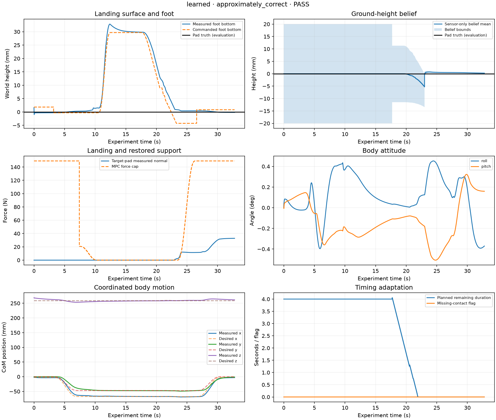

# Adjustable landing pad — PASS

Planner: **learned**. Role: **development**. Height condition: **approximately_correct**.

| Metric | Value |
|---|---:|
| sample_count | 16389 |
| duration_s | 32.777999999994094 |
| mpc_updates | 3280 |
| maximum_abs_roll_pitch_deg | 0.5074855718043808 |
| maximum_abs_actuator_torque_nm | 11.962391546111284 |
| final_complete_duration_s | 2.0020000000000002 |
| maximum_logged_vs_independent_margin_difference_m | 0.0 |
| success | True |
| completion_time_s | 32.777999999994094 |
| lowering_to_touchdown_s | 5.297999999997064 |
| lowering_to_completion_s | 15.073999999993028 |
| first_target_touchdown_time_s | 23.00199999999813 |
| nominal_touchdown_deadline_s | 21.704000000001066 |
| touchdown_minus_nominal_deadline_s | 1.2979999999970637 |
| observed_contact_timing | late |
| missing_contact_observed | False |
| first_missing_contact_time_s | None |
| missing_contact_before_physical_touchdown | False |
| recovery_to_touchdown_s | 0.0 |
| peak_normal_force_first_100ms_n | 1.33511540937904 |
| normal_impulse_first_100ms_ns | 0.11801230658920853 |
| maximum_roll_pitch_change_during_landing_deg | 0.4317603413022428 |
| maximum_com_reference_error_during_landing_m | 0.015172386199040697 |
| maximum_body_rotation_during_landing_deg | 0.9329327599322815 |
| height_belief_final_error_m | 0.0002445838212663381 |
| height_belief_error_at_contact_confirmation_m | 0.0006482307659442738 |
| planner_update_count | 114 |
| planner_mean_compute_time_s | 0.0004310703509059079 |
| planner_maximum_compute_time_s | 0.0008875889998307684 |
| reference_projection_count | 12.0 |
| planner_fallback_count | 30.0 |

| Check | Result | Observed |
|---|---|---|
| completed | PASS | {"status": "completed", "completed_cycles": 1} |
| cycle_labels | PASS | [1] |
| sample_clock | PASS | {"rows": 16389, "last_time_s": 32.777999999994094} |
| control_alignment | PASS | 2.444225377651321e-15 |
| mpc_update_cadence | PASS | {"configured_frequency_hz": 100.0, "effective_periodic_frequency_hz": 100.0, "period_in_physics_steps": 5, "step_sequence_valid": true, "expected_updates": 3280, "recorded_updates": 3280, "extra_support_change_updates": 2, "missing_periodic_updates": 0, "missing_support_change_updates": 0, "unexpected_updates": 0} |
| finite_data | PASS | [] |
| no_termination | PASS | 0 |
| no_numerical_warnings | PASS | 0.0 |
| no_torque_saturation | PASS | 0 |
| qp_success | PASS | {"0": 3280} |
| nlp_status | PASS | {"2": 2980} |
| selected_force_cap | PASS | -0.0 |
| body_tilt | PASS | 0.5074855718043808 |
| cycle_1_phase_order | PASS | ["stand", "shift", "unload", "lift", "hold", "lower", "confirm", "reload", "recenter", "complete"] |
| cycle_1_hold_duration | PASS | 5.0 |
| cycle_1_hold_contact | PASS | {"selected_measured_samples": 0, "selected_planned_samples": 0, "missing_support_measured_samples": 0, "missing_support_planned_samples": 0} |
| cycle_1_swing_schedule | PASS | {"selected_planned_samples": 0, "missing_support_planned_samples": 0} |
| cycle_1_support_contact_continuity | PASS | 0 |
| cycle_1_hold_clearance | PASS | 0.030134376927601916 |
| cycle_1_support_margin | PASS | {"independent_minimum_m": 0.06959821637692096, "logged_minimum_m": 0.06959821637692096} |
| cycle_1_fixed_lift_reference | PASS | true |
| cycle_1_foot_tracking | PASS | 0.005658640116907009 |
| cycle_1_support_slip | PASS | 0.007497378492210899 |
| cycle_1_lift_entry_guard | PASS | {"last_unload_time_s": 10.504000000000177, "selected_normal_force_n": 0.0, "minimum_support_normal_force_n": 45.07142988585428, "physical_support_margin_m": 0.06906348433927874, "selected_force_cap_n": 0.0} |
| cycle_1_force_cap_ramps | PASS | {"unload_duration_s": 3.1, "reload_duration_s": 3.202, "maximum_unload_cap_increase_n": 0.0, "maximum_reload_cap_decrease_n": -0.0} |
| cycle_1_reload_gate | PASS | {"time_s": 23.373999999997924, "contact_confirmed": true, "measured_contact": true, "dwell_s": 0.09999999999994458, "independent_debounce_samples": 49, "independent_debounce_duration_s": 0.098, "independent_debounce_min_normal_force_n": 2.0117348944363056, "independent_debounce_passed": true} |
| cycle_1_reload_loading | PASS | {"reload_dwell_s": 0.2, "first_recenter_time_s": 26.57599999999615, "minimum_normal_force_n_by_leg": {"FL": 11.513384417845247, "FR": 37.14466252376744, "RL": 40.10618552540001, "RR": 60.34786952235842}, "missing_measured_or_planned_contacts": 0} |
| final_four_foot_stance | PASS | 2.0020000000000002 |
| final_four_foot_loading | PASS | {"duration_s": 2.0020000000000002, "minimum_normal_force_n_by_leg": {"FL": 32.150836331692446, "FR": 34.16704021153903, "RL": 40.108992398522155, "RR": 41.10760087955047}} |
| pad_configuration | PASS | {"experiment": "landing_pad", "cycles": 1, "max_search_depth_m": 0.02, "contact_compression_m": 0.004} |
| pad_fixed_support_surfaces | PASS | [0.0, 0.0, 0.0, 0.0] |
| pad_truth_separation_schema | PASS | [] |
| pad_bounded_descent | PASS | {"minimum_commanded_bottom_m": -0.0042461374244505724, "minimum_allowed_bottom_m": -0.024} |
| pad_physical_reach | PASS | {"minimum_actual_bottom_m": -0.00015457464276257687, "minimum_allowed_bottom_m": -0.04} |
| pad_foot_bottom_consistency | PASS | 0.0 |
| pad_target_force_consistency | PASS | {"maximum_target_force_n": 32.827318091280645, "maximum_target_minus_total_normal_n": 0.0} |
| pad_final_target_loading | PASS | {"minimum_normal_force_n": 32.150836331692446, "maximum_xy_target_error_m": 0.0028103619218388474, "missing_target_contact_samples": 0} |
| pad_final_height_consistency | PASS | 0.00015457464276257687 |
| pad_target_contact_before_reload | PASS | {"required_samples": 49, "first_reload_time_s": 23.373999999997924} |
| pad_target_reload_loading | PASS | 11.513384417845247 |
| pad_belief_bounds | PASS | null |
| pad_sensor_causality | PASS | {"maximum_future_lead_s": 0.0} |
| pad_planner_execution | PASS | {"updates": 114, "maximum_fallback_count": 30.0} |

- **impact:** Simulated target-pad normal reaction over exactly 100 ms after first physical target contact; impulse is the rectangle-rule integral, including static load.
- **body_disturbance:** Roll/pitch change from lowering entry and CoM tracking error are reported separately from intentionally commanded body motion.
- **timing:** Physical contact time uses post-step evaluation contacts. Nominal deadline is lowering entry plus requested nominal duration; approximately planned means within 0.25 s. This descriptive label is not an acceptance criterion.
- **height_truth:** Actual height is used only by the simulator and this evaluator. Schema checks do not prove absence of arbitrary numeric information leaks; planner API tests and code review complement them.
- **completion:** All inherited controlled-step criteria and additional pad checks must pass. No relative planner superiority is assumed.

Full requirements and metrics: `pad_summary.json`. Core execution checks: `step_report.md`. Measurements: `signals.npz`; simulator-only truth: `metadata.json` → `evaluation`.
