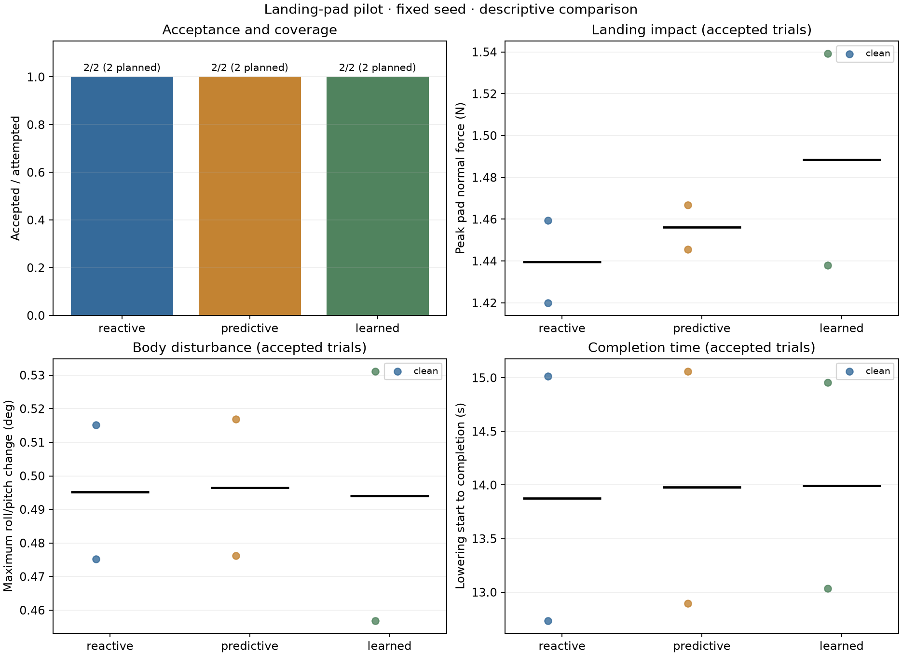

# Landing-pad planner comparison

Descriptive pilot with one seed and one attempt per planner/height/sensing cell. The ±7.5 mm heights were predeclared before these trials and were excluded from demonstration fitting and live engineering development. Sensing is clean. The original trained model and the controller/source from the paired eighteen-cell pilot remain fixed; no refitting uses these six trials. Failed and missing cells remain visible. Impact and completion summaries below use successful trials only, so compare them alongside success and coverage. These data do not establish statistical superiority.

Coverage: **6/6** declared evaluation cells attempted; **6** accepted trials.

The CSV contains every declared cell. JSON includes the split, model provenance, raw acceptance summaries, and consistency checks.

| Planner | Accepted / attempted / planned | Median impact peak (N) | Median tilt change (deg) | Median lowering-to-completion (s) | Median fallback updates | Trials using fallback |
| --- | ---: | ---: | ---: | ---: | ---: | ---: |
| reactive | 2 / 2 / 2 | 1.440 | 0.495 | 13.874 | 0.0 | 0 / 2 |
| predictive | 2 / 2 / 2 | 1.456 | 0.497 | 13.978 | 0.0 | 0 / 2 |
| learned | 2 / 2 / 2 | 1.489 | 0.494 | 13.995 | 15.0 | 2 / 2 |

Metric medians include accepted trials only. The JSON records the sample count for every metric.

Fallback counts identify departures from a planner's nominal motion: learned-motion fallback extends descent after model phase 1; predictive-planner fallback handles optimization failure. Native contact-triggered recovery in the other planners is not counted as learned-motion fallback.

The learned planner used bounded fallback in **2 / 2** trials with recorded counts (**30 planning updates** total). Success therefore includes the common recovery behavior when invoked.

| Planner | Height (mm) | Sensing | Accepted | Impact peak (N) | Tilt change (deg) | Lowering-to-completion (s) | Fallback updates | Recording |
| --- | ---: | --- | --- | ---: | ---: | ---: | ---: | --- |
| reactive | -7.5 | clean | PASS | 1.459 | 0.475 | 15.014 | 0 | [pad_reactive_20260921T074309_905575Z](<../recordings/pad_reactive_20260921T074309_905575Z/pad_report.md>) |
| predictive | -7.5 | clean | PASS | 1.467 | 0.476 | 15.060 | 0 | [pad_predictive_20260921T074351_535116Z](<../recordings/pad_predictive_20260921T074351_535116Z/pad_report.md>) |
| learned | -7.5 | clean | PASS | 1.438 | 0.457 | 14.956 | 28 | [pad_learned_20260921T074431_595543Z](<../recordings/pad_learned_20260921T074431_595543Z/pad_report.md>) |
| reactive | +7.5 | clean | PASS | 1.420 | 0.515 | 12.734 | 0 | [pad_reactive_20260921T074511_234520Z](<../recordings/pad_reactive_20260921T074511_234520Z/pad_report.md>) |
| predictive | +7.5 | clean | PASS | 1.446 | 0.517 | 12.896 | 0 | [pad_predictive_20260921T074548_342858Z](<../recordings/pad_predictive_20260921T074548_342858Z/pad_report.md>) |
| learned | +7.5 | clean | PASS | 1.539 | 0.531 | 13.034 | 2 | [pad_learned_20260921T074625_602021Z](<../recordings/pad_learned_20260921T074625_602021Z/pad_report.md>) |

Measured simulated pad-normal reaction during the first 100 ms after physical contact, including static load.

Roll/pitch change from lowering entry; intentional body motion contributes. CoM reference error is separately recorded.

No planner ranking is inferred from this small pilot. Broader repetitions and predeclared held-out conditions are needed before making performance claims.
