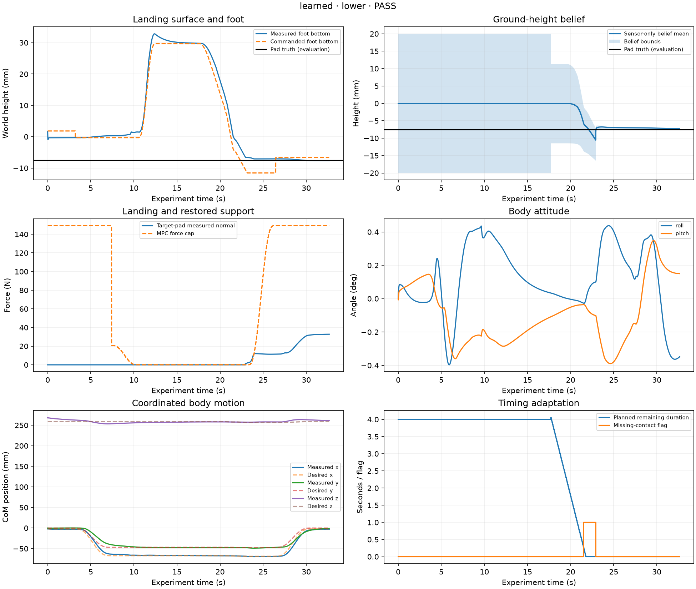

# Adjustable landing pad — PASS

Planner: **learned**. Role: **evaluation**. Height condition: **lower**.

| Metric | Value |
|---|---:|
| sample_count | 16330 |
| duration_s | 32.65999999999395 |
| mpc_updates | 3268 |
| maximum_abs_roll_pitch_deg | 0.4373701634643483 |
| maximum_abs_actuator_torque_nm | 11.978594457371216 |
| final_complete_duration_s | 2.0020000000000002 |
| maximum_logged_vs_independent_margin_difference_m | 0.0 |
| success | True |
| completion_time_s | 32.65999999999395 |
| lowering_to_touchdown_s | 5.221999999997106 |
| lowering_to_completion_s | 14.955999999992883 |
| first_target_touchdown_time_s | 22.925999999998172 |
| nominal_touchdown_deadline_s | 21.704000000001066 |
| touchdown_minus_nominal_deadline_s | 1.2219999999971058 |
| observed_contact_timing | late |
| missing_contact_observed | True |
| first_missing_contact_time_s | 21.491999999998967 |
| missing_contact_before_physical_touchdown | True |
| recovery_to_touchdown_s | 1.4339999999992052 |
| peak_normal_force_first_100ms_n | 1.437992870575754 |
| normal_impulse_first_100ms_ns | 0.12644871562434026 |
| maximum_roll_pitch_change_during_landing_deg | 0.45685061906537366 |
| maximum_com_reference_error_during_landing_m | 0.015145199131662075 |
| maximum_body_rotation_during_landing_deg | 0.9548443682742648 |
| height_belief_final_error_m | 0.00024313974226711135 |
| height_belief_error_at_contact_confirmation_m | 0.0006617501931293988 |
| planner_update_count | 110 |
| planner_mean_compute_time_s | 0.000471156945406454 |
| planner_maximum_compute_time_s | 0.0008789809999143472 |
| reference_projection_count | 22.0 |
| planner_fallback_count | 28.0 |
| learned_conditioning_updates | 19.0 |
| learned_duration_min_s | 3.914588957674802 |
| learned_duration_max_s | 4.160281780180911 |
| predictive_optimization_failures | 0.0 |

| Check | Result | Observed |
|---|---|---|
| completed | PASS | {"status": "completed", "completed_cycles": 1} |
| cycle_labels | PASS | [1] |
| sample_clock | PASS | {"rows": 16330, "last_time_s": 32.65999999999395} |
| control_alignment | PASS | 2.444225377651321e-15 |
| mpc_update_cadence | PASS | {"configured_frequency_hz": 100.0, "effective_periodic_frequency_hz": 100.0, "period_in_physics_steps": 5, "step_sequence_valid": true, "expected_updates": 3268, "recorded_updates": 3268, "extra_support_change_updates": 2, "missing_periodic_updates": 0, "missing_support_change_updates": 0, "unexpected_updates": 0} |
| finite_data | PASS | [] |
| no_termination | PASS | 0 |
| no_numerical_warnings | PASS | 0.0 |
| no_torque_saturation | PASS | 0 |
| qp_success | PASS | {"0": 3268} |
| nlp_status | PASS | {"2": 2968} |
| selected_force_cap | PASS | -0.0 |
| body_tilt | PASS | 0.4373701634643483 |
| cycle_1_phase_order | PASS | ["stand", "shift", "unload", "lift", "hold", "lower", "confirm", "reload", "recenter", "complete"] |
| cycle_1_hold_duration | PASS | 5.0 |
| cycle_1_hold_contact | PASS | {"selected_measured_samples": 0, "selected_planned_samples": 0, "missing_support_measured_samples": 0, "missing_support_planned_samples": 0} |
| cycle_1_swing_schedule | PASS | {"selected_planned_samples": 0, "missing_support_planned_samples": 0} |
| cycle_1_support_contact_continuity | PASS | 0 |
| cycle_1_hold_clearance | PASS | 0.030134376927601916 |
| cycle_1_support_margin | PASS | {"independent_minimum_m": 0.06959821637692096, "logged_minimum_m": 0.06959821637692096} |
| cycle_1_fixed_lift_reference | PASS | true |
| cycle_1_foot_tracking | PASS | 0.005465040218419279 |
| cycle_1_support_slip | PASS | 0.007619199140402813 |
| cycle_1_lift_entry_guard | PASS | {"last_unload_time_s": 10.504000000000177, "selected_normal_force_n": 0.0, "minimum_support_normal_force_n": 45.07142988585428, "physical_support_margin_m": 0.06906348433927874, "selected_force_cap_n": 0.0} |
| cycle_1_force_cap_ramps | PASS | {"unload_duration_s": 3.1, "reload_duration_s": 3.202, "maximum_unload_cap_increase_n": 0.0, "maximum_reload_cap_decrease_n": -0.0} |
| cycle_1_reload_gate | PASS | {"time_s": 23.25599999999799, "contact_confirmed": true, "measured_contact": true, "dwell_s": 0.09999999999994458, "independent_debounce_samples": 49, "independent_debounce_duration_s": 0.098, "independent_debounce_min_normal_force_n": 2.0096735212505648, "independent_debounce_passed": true} |
| cycle_1_reload_loading | PASS | {"reload_dwell_s": 0.2, "first_recenter_time_s": 26.457999999996215, "minimum_normal_force_n_by_leg": {"FL": 11.437646681936798, "FR": 36.9925550490985, "RL": 40.24760774141171, "RR": 60.43776483038135}, "missing_measured_or_planned_contacts": 0} |
| final_four_foot_stance | PASS | 2.0020000000000002 |
| final_four_foot_loading | PASS | {"duration_s": 2.0020000000000002, "minimum_normal_force_n_by_leg": {"FL": 32.17020600940107, "FR": 34.17189995899357, "RL": 39.99931238861369, "RR": 41.14637703557313}} |
| pad_reference_limit_configuration | PASS | {"max_foot_speed_m_s": 0.015, "search_speed_m_s": 0.005, "max_com_speed_m_s": 0.008, "max_body_displacement_m": 0.012, "target_xy_tolerance_m": 0.005, "max_orientation_deviation_rad": 0.03490658503988659, "max_orientation_rate_rad_s": 0.02} |
| pad_finite_planner_signals | PASS | null |
| pad_commanded_foot_speed | PASS | {"maximum_m_s": 0.015000000000208987, "limit_m_s": 0.015} |
| pad_commanded_com_speed | PASS | {"maximum_m_s": 0.003988097331204869, "limit_m_s": 0.008} |
| pad_monotone_lowering | PASS | {"maximum_upward_speed_m_s": 0.0} |
| pad_commanded_body_displacement | PASS | {"maximum_m": 0.0019641245842894617, "limit_m": 0.012} |
| pad_commanded_target_xy | PASS | {"maximum_coordinate_error_m": 0.0017131131948885936, "limit_m": 0.005} |
| pad_commanded_orientation | PASS | {"maximum_deviation_rad": 0.0027319602367317777, "maximum_rate_rad_s": 0.02000000000027709} |
| pad_contact_reference_freeze | PASS | {"maximum_foot_speed_m_s": 0.0, "maximum_com_speed_m_s": 0.0} |
| pad_planner_update_cadence | PASS | {"frequency_hz": 20.0, "period_steps": 25, "missing_updates": 0, "unexpected_updates": 0} |
| pad_commanded_recovery_speed | PASS | {"checked_intervals": 725, "maximum_m_s": 0.005000000000070488, "limit_m_s": 0.005} |
| pad_configuration | PASS | {"experiment": "landing_pad", "cycles": 1, "max_search_depth_m": 0.02, "contact_compression_m": 0.004} |
| pad_fixed_support_surfaces | PASS | [0.0, 0.0, 0.0, 0.0] |
| pad_truth_separation_schema | PASS | [] |
| pad_bounded_descent | PASS | {"minimum_commanded_bottom_m": -0.011565609688545267, "minimum_allowed_bottom_m": -0.024} |
| pad_physical_reach | PASS | {"minimum_actual_bottom_m": -0.007654399759819193, "minimum_allowed_bottom_m": -0.04} |
| pad_foot_bottom_consistency | PASS | 0.0 |
| pad_target_force_consistency | PASS | {"maximum_target_force_n": 32.821760853006204, "maximum_target_minus_total_normal_n": 0.0} |
| pad_final_target_loading | PASS | {"minimum_normal_force_n": 32.17020600940107, "maximum_xy_target_error_m": 0.002406033031623855, "missing_target_contact_samples": 0} |
| pad_final_height_consistency | PASS | 0.00015439975981919318 |
| pad_target_contact_before_reload | PASS | {"required_samples": 49, "first_reload_time_s": 23.25599999999799} |
| pad_target_reload_loading | PASS | 11.437646681936798 |
| pad_belief_bounds | PASS | null |
| pad_sensor_causality | PASS | {"maximum_future_lead_s": 0.0} |
| pad_planner_execution | PASS | {"updates": 110, "maximum_fallback_count": 28.0} |

- **impact:** Simulated target-pad normal reaction over exactly 100 ms after first physical target contact; impulse is the rectangle-rule integral, including static load.
- **body_disturbance:** Roll/pitch change from lowering entry and CoM tracking error are reported separately from intentionally commanded body motion.
- **timing:** Physical contact time uses post-step evaluation contacts. Nominal deadline is lowering entry plus requested nominal duration; approximately planned means within 0.25 s. This descriptive label is not an acceptance criterion.
- **height_truth:** Actual height is used only by the simulator and this evaluator. Schema checks do not prove absence of arbitrary numeric information leaks; planner API tests and code review complement them.
- **completion:** All inherited controlled-step criteria and additional pad checks must pass. No relative planner superiority is assumed.

Full requirements and metrics: `pad_summary.json`. Core execution checks: `step_report.md`. Measurements: `signals.npz`; simulator-only truth: `metadata.json` → `evaluation`.
