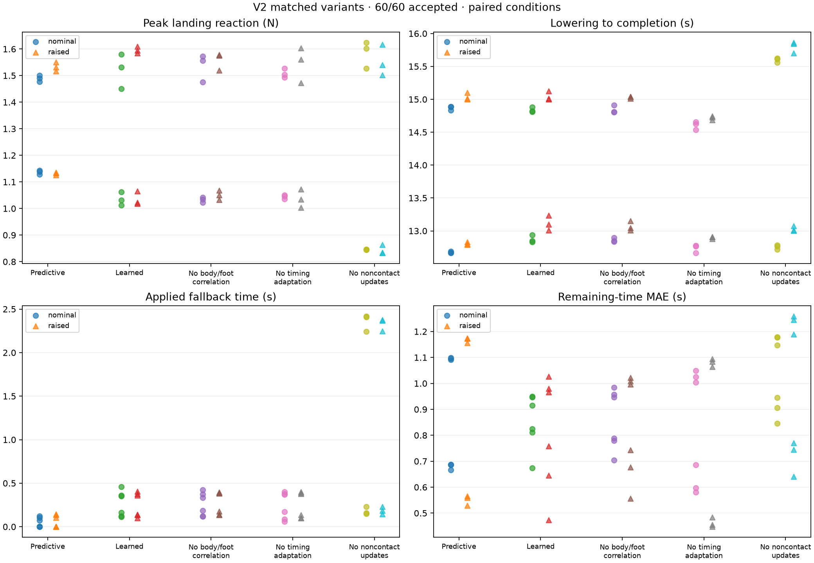

# V2 matched-planner comparison

Five matched variants across twelve paired height/seed/initial-condition cells. Each ablation is compared with the complete learned variant; the complete learned variant is compared with matched predictive. Failures and missing cells remain in coverage/success accounting. Metric differences require both paired trials to pass. Three noise seeds and two initial clearances support descriptive repeatability checks, not an automatic superiority claim.

Coverage: **60/60**; accepted: **60**.

| Variant | Accepted / attempted / planned | Median peak (N) | Median lower-to-completion (s) | Median fallback time (s) | Median fallback descent (mm) | Positive remaining-time fraction |
| --- | ---: | ---: | ---: | ---: | ---: | ---: |
| matched_predictive | 12/12/12 | 1.310 | 13.832 | 0.037 | 0.032 | 1.000 |
| matched_learned | 12/12/12 | 1.258 | 14.022 | 0.256 | 0.368 | 1.000 |
| matched_no_body_foot_correlation | 12/12/12 | 1.271 | 13.979 | 0.259 | 0.427 | 1.000 |
| matched_no_timing_adaptation | 12/12/12 | 1.273 | 13.722 | 0.270 | 0.363 | 1.000 |
| matched_no_noncontact_updates | 12/12/12 | 1.183 | 14.316 | 1.237 | 2.474 | 1.000 |

Medians use accepted trials only; JSON records every sample count and paired success outcome.

| Variant | Raw model time positive fraction | Raw recovery time positive fraction | Median minimum raw recovery time (s) | Median learned-prior use fraction |
| --- | ---: | ---: | ---: | ---: |
| matched_predictive | — | — | — | 0.000 |
| matched_learned | 1.000 | 1.000 | 0.292 | 0.761 |
| matched_no_body_foot_correlation | 1.000 | 1.000 | 0.291 | 0.753 |
| matched_no_timing_adaptation | 1.000 | 1.000 | 0.294 | 0.745 |
| matched_no_noncontact_updates | 1.000 | 1.000 | 0.278 | 0.603 |

Raw model timing is measured before feasibility floors; the conventional baseline has no learned-model timing.

| Paired contrast | Accepted pairs | Median completion-time difference (s) | Median fallback-time difference (s) |
| --- | ---: | ---: | ---: |
| matched_learned minus matched_predictive | 12/12 | 0.104 | 0.204 |
| matched_no_body_foot_correlation minus matched_learned | 12/12 | 0.000 | 0.010 |
| matched_no_timing_adaptation minus matched_learned | 12/12 | -0.194 | -0.002 |
| matched_no_noncontact_updates minus matched_learned | 12/12 | 0.350 | 0.989 |

The CSV files contain every trial and each paired metric difference. Actual initial foot and CoM states are included alongside nominal/raised labels.

Actual applied fallback time and displacement are independently integrated with the preceding sample owning each interval. Counts are reported separately and cannot substitute for active work.

Positive remaining-time fractions use unsupported planning updates. MAE compares the proposed remaining time with measured time to confirmed reload, including confirmation dwell; it is an execution calibration diagnostic, not a prospective statistical guarantee.

| Trial | Initial condition | Seed | Accepted | Recording |
| --- | --- | ---: | --- | --- |
| eval_matched_predictive_h-6mm_seed17_nominal | nominal | 17 | PASS | [pad_matched_predictive_20260921T083449_152540Z](<../evaluation/pad_matched_predictive_20260921T083449_152540Z/pad_report.md>) |
| eval_matched_learned_h-6mm_seed17_nominal | nominal | 17 | PASS | [pad_matched_learned_20260921T083449_239195Z](<../evaluation/pad_matched_learned_20260921T083449_239195Z/pad_report.md>) |
| eval_matched_no_body_foot_correlation_h-6mm_seed17_nominal | nominal | 17 | PASS | [pad_matched_no_body_foot_correlation_20260921T083449_310325Z](<../evaluation/pad_matched_no_body_foot_correlation_20260921T083449_310325Z/pad_report.md>) |
| eval_matched_no_timing_adaptation_h-6mm_seed17_nominal | nominal | 17 | PASS | [pad_matched_no_timing_adaptation_20260921T083449_377847Z](<../evaluation/pad_matched_no_timing_adaptation_20260921T083449_377847Z/pad_report.md>) |
| eval_matched_no_noncontact_updates_h-6mm_seed17_nominal | nominal | 17 | PASS | [pad_matched_no_noncontact_updates_20260921T083530_270313Z](<../evaluation/pad_matched_no_noncontact_updates_20260921T083530_270313Z/pad_report.md>) |
| eval_matched_predictive_h-6mm_seed17_raised | raised | 17 | PASS | [pad_matched_predictive_20260921T083531_018134Z](<../evaluation/pad_matched_predictive_20260921T083531_018134Z/pad_report.md>) |
| eval_matched_learned_h-6mm_seed17_raised | raised | 17 | PASS | [pad_matched_learned_20260921T083531_182251Z](<../evaluation/pad_matched_learned_20260921T083531_182251Z/pad_report.md>) |
| eval_matched_no_body_foot_correlation_h-6mm_seed17_raised | raised | 17 | PASS | [pad_matched_no_body_foot_correlation_20260921T083531_318360Z](<../evaluation/pad_matched_no_body_foot_correlation_20260921T083531_318360Z/pad_report.md>) |
| eval_matched_no_timing_adaptation_h-6mm_seed17_raised | raised | 17 | PASS | [pad_matched_no_timing_adaptation_20260921T083612_409916Z](<../evaluation/pad_matched_no_timing_adaptation_20260921T083612_409916Z/pad_report.md>) |
| eval_matched_no_noncontact_updates_h-6mm_seed17_raised | raised | 17 | PASS | [pad_matched_no_noncontact_updates_20260921T083613_021480Z](<../evaluation/pad_matched_no_noncontact_updates_20260921T083613_021480Z/pad_report.md>) |
| eval_matched_predictive_h-6mm_seed29_nominal | nominal | 29 | PASS | [pad_matched_predictive_20260921T083613_603295Z](<../evaluation/pad_matched_predictive_20260921T083613_603295Z/pad_report.md>) |
| eval_matched_learned_h-6mm_seed29_nominal | nominal | 29 | PASS | [pad_matched_learned_20260921T083613_771760Z](<../evaluation/pad_matched_learned_20260921T083613_771760Z/pad_report.md>) |
| eval_matched_no_body_foot_correlation_h-6mm_seed29_nominal | nominal | 29 | PASS | [pad_matched_no_body_foot_correlation_20260921T083654_205028Z](<../evaluation/pad_matched_no_body_foot_correlation_20260921T083654_205028Z/pad_report.md>) |
| eval_matched_no_timing_adaptation_h-6mm_seed29_nominal | nominal | 29 | PASS | [pad_matched_no_timing_adaptation_20260921T083654_735566Z](<../evaluation/pad_matched_no_timing_adaptation_20260921T083654_735566Z/pad_report.md>) |
| eval_matched_no_noncontact_updates_h-6mm_seed29_nominal | nominal | 29 | PASS | [pad_matched_no_noncontact_updates_20260921T083655_719649Z](<../evaluation/pad_matched_no_noncontact_updates_20260921T083655_719649Z/pad_report.md>) |
| eval_matched_predictive_h-6mm_seed29_raised | raised | 29 | PASS | [pad_matched_predictive_20260921T083656_202450Z](<../evaluation/pad_matched_predictive_20260921T083656_202450Z/pad_report.md>) |
| eval_matched_learned_h-6mm_seed29_raised | raised | 29 | PASS | [pad_matched_learned_20260921T083736_153381Z](<../evaluation/pad_matched_learned_20260921T083736_153381Z/pad_report.md>) |
| eval_matched_no_body_foot_correlation_h-6mm_seed29_raised | raised | 29 | PASS | [pad_matched_no_body_foot_correlation_20260921T083736_500836Z](<../evaluation/pad_matched_no_body_foot_correlation_20260921T083736_500836Z/pad_report.md>) |
| eval_matched_no_timing_adaptation_h-6mm_seed29_raised | raised | 29 | PASS | [pad_matched_no_timing_adaptation_20260921T083737_721199Z](<../evaluation/pad_matched_no_timing_adaptation_20260921T083737_721199Z/pad_report.md>) |
| eval_matched_no_noncontact_updates_h-6mm_seed29_raised | raised | 29 | PASS | [pad_matched_no_noncontact_updates_20260921T083738_570540Z](<../evaluation/pad_matched_no_noncontact_updates_20260921T083738_570540Z/pad_report.md>) |
| eval_matched_predictive_h-6mm_seed43_nominal | nominal | 43 | PASS | [pad_matched_predictive_20260921T083818_368516Z](<../evaluation/pad_matched_predictive_20260921T083818_368516Z/pad_report.md>) |
| eval_matched_learned_h-6mm_seed43_nominal | nominal | 43 | PASS | [pad_matched_learned_20260921T083818_730723Z](<../evaluation/pad_matched_learned_20260921T083818_730723Z/pad_report.md>) |
| eval_matched_no_body_foot_correlation_h-6mm_seed43_nominal | nominal | 43 | PASS | [pad_matched_no_body_foot_correlation_20260921T083819_778038Z](<../evaluation/pad_matched_no_body_foot_correlation_20260921T083819_778038Z/pad_report.md>) |
| eval_matched_no_timing_adaptation_h-6mm_seed43_nominal | nominal | 43 | PASS | [pad_matched_no_timing_adaptation_20260921T083821_676913Z](<../evaluation/pad_matched_no_timing_adaptation_20260921T083821_676913Z/pad_report.md>) |
| eval_matched_no_noncontact_updates_h-6mm_seed43_nominal | nominal | 43 | PASS | [pad_matched_no_noncontact_updates_20260921T083900_010463Z](<../evaluation/pad_matched_no_noncontact_updates_20260921T083900_010463Z/pad_report.md>) |
| eval_matched_predictive_h-6mm_seed43_raised | raised | 43 | PASS | [pad_matched_predictive_20260921T083901_253105Z](<../evaluation/pad_matched_predictive_20260921T083901_253105Z/pad_report.md>) |
| eval_matched_learned_h-6mm_seed43_raised | raised | 43 | PASS | [pad_matched_learned_20260921T083902_538577Z](<../evaluation/pad_matched_learned_20260921T083902_538577Z/pad_report.md>) |
| eval_matched_no_body_foot_correlation_h-6mm_seed43_raised | raised | 43 | PASS | [pad_matched_no_body_foot_correlation_20260921T083904_453680Z](<../evaluation/pad_matched_no_body_foot_correlation_20260921T083904_453680Z/pad_report.md>) |
| eval_matched_no_timing_adaptation_h-6mm_seed43_raised | raised | 43 | PASS | [pad_matched_no_timing_adaptation_20260921T083942_556703Z](<../evaluation/pad_matched_no_timing_adaptation_20260921T083942_556703Z/pad_report.md>) |
| eval_matched_no_noncontact_updates_h-6mm_seed43_raised | raised | 43 | PASS | [pad_matched_no_noncontact_updates_20260921T083942_731274Z](<../evaluation/pad_matched_no_noncontact_updates_20260921T083942_731274Z/pad_report.md>) |
| eval_matched_predictive_h+6mm_seed17_nominal | nominal | 17 | PASS | [pad_matched_predictive_20260921T083944_665504Z](<../evaluation/pad_matched_predictive_20260921T083944_665504Z/pad_report.md>) |
| eval_matched_learned_h+6mm_seed17_nominal | nominal | 17 | PASS | [pad_matched_learned_20260921T083946_591771Z](<../evaluation/pad_matched_learned_20260921T083946_591771Z/pad_report.md>) |
| eval_matched_no_body_foot_correlation_h+6mm_seed17_nominal | nominal | 17 | PASS | [pad_matched_no_body_foot_correlation_20260921T084024_875310Z](<../evaluation/pad_matched_no_body_foot_correlation_20260921T084024_875310Z/pad_report.md>) |
| eval_matched_no_timing_adaptation_h+6mm_seed17_nominal | nominal | 17 | PASS | [pad_matched_no_timing_adaptation_20260921T084025_791186Z](<../evaluation/pad_matched_no_timing_adaptation_20260921T084025_791186Z/pad_report.md>) |
| eval_matched_no_noncontact_updates_h+6mm_seed17_nominal | nominal | 17 | PASS | [pad_matched_no_noncontact_updates_20260921T084027_340423Z](<../evaluation/pad_matched_no_noncontact_updates_20260921T084027_340423Z/pad_report.md>) |
| eval_matched_predictive_h+6mm_seed17_raised | raised | 17 | PASS | [pad_matched_predictive_20260921T084027_478669Z](<../evaluation/pad_matched_predictive_20260921T084027_478669Z/pad_report.md>) |
| eval_matched_learned_h+6mm_seed17_raised | raised | 17 | PASS | [pad_matched_learned_20260921T084106_553728Z](<../evaluation/pad_matched_learned_20260921T084106_553728Z/pad_report.md>) |
| eval_matched_no_body_foot_correlation_h+6mm_seed17_raised | raised | 17 | PASS | [pad_matched_no_body_foot_correlation_20260921T084107_451645Z](<../evaluation/pad_matched_no_body_foot_correlation_20260921T084107_451645Z/pad_report.md>) |
| eval_matched_no_timing_adaptation_h+6mm_seed17_raised | raised | 17 | PASS | [pad_matched_no_timing_adaptation_20260921T084108_382078Z](<../evaluation/pad_matched_no_timing_adaptation_20260921T084108_382078Z/pad_report.md>) |
| eval_matched_no_noncontact_updates_h+6mm_seed17_raised | raised | 17 | PASS | [pad_matched_no_noncontact_updates_20260921T084108_843983Z](<../evaluation/pad_matched_no_noncontact_updates_20260921T084108_843983Z/pad_report.md>) |
| eval_matched_predictive_h+6mm_seed29_nominal | nominal | 29 | PASS | [pad_matched_predictive_20260921T084148_697547Z](<../evaluation/pad_matched_predictive_20260921T084148_697547Z/pad_report.md>) |
| eval_matched_learned_h+6mm_seed29_nominal | nominal | 29 | PASS | [pad_matched_learned_20260921T084149_318454Z](<../evaluation/pad_matched_learned_20260921T084149_318454Z/pad_report.md>) |
| eval_matched_no_body_foot_correlation_h+6mm_seed29_nominal | nominal | 29 | PASS | [pad_matched_no_body_foot_correlation_20260921T084149_864811Z](<../evaluation/pad_matched_no_body_foot_correlation_20260921T084149_864811Z/pad_report.md>) |
| eval_matched_no_timing_adaptation_h+6mm_seed29_nominal | nominal | 29 | PASS | [pad_matched_no_timing_adaptation_20260921T084151_011085Z](<../evaluation/pad_matched_no_timing_adaptation_20260921T084151_011085Z/pad_report.md>) |
| eval_matched_no_noncontact_updates_h+6mm_seed29_nominal | nominal | 29 | PASS | [pad_matched_no_noncontact_updates_20260921T084229_740096Z](<../evaluation/pad_matched_no_noncontact_updates_20260921T084229_740096Z/pad_report.md>) |
| eval_matched_predictive_h+6mm_seed29_raised | raised | 29 | PASS | [pad_matched_predictive_20260921T084230_893085Z](<../evaluation/pad_matched_predictive_20260921T084230_893085Z/pad_report.md>) |
| eval_matched_learned_h+6mm_seed29_raised | raised | 29 | PASS | [pad_matched_learned_20260921T084231_289766Z](<../evaluation/pad_matched_learned_20260921T084231_289766Z/pad_report.md>) |
| eval_matched_no_body_foot_correlation_h+6mm_seed29_raised | raised | 29 | PASS | [pad_matched_no_body_foot_correlation_20260921T084232_283295Z](<../evaluation/pad_matched_no_body_foot_correlation_20260921T084232_283295Z/pad_report.md>) |
| eval_matched_no_timing_adaptation_h+6mm_seed29_raised | raised | 29 | PASS | [pad_matched_no_timing_adaptation_20260921T084311_610218Z](<../evaluation/pad_matched_no_timing_adaptation_20260921T084311_610218Z/pad_report.md>) |
| eval_matched_no_noncontact_updates_h+6mm_seed29_raised | raised | 29 | PASS | [pad_matched_no_noncontact_updates_20260921T084312_152260Z](<../evaluation/pad_matched_no_noncontact_updates_20260921T084312_152260Z/pad_report.md>) |
| eval_matched_predictive_h+6mm_seed43_nominal | nominal | 43 | PASS | [pad_matched_predictive_20260921T084313_444637Z](<../evaluation/pad_matched_predictive_20260921T084313_444637Z/pad_report.md>) |
| eval_matched_learned_h+6mm_seed43_nominal | nominal | 43 | PASS | [pad_matched_learned_20260921T084314_548011Z](<../evaluation/pad_matched_learned_20260921T084314_548011Z/pad_report.md>) |
| eval_matched_no_body_foot_correlation_h+6mm_seed43_nominal | nominal | 43 | PASS | [pad_matched_no_body_foot_correlation_20260921T084353_199910Z](<../evaluation/pad_matched_no_body_foot_correlation_20260921T084353_199910Z/pad_report.md>) |
| eval_matched_no_timing_adaptation_h+6mm_seed43_nominal | nominal | 43 | PASS | [pad_matched_no_timing_adaptation_20260921T084353_722096Z](<../evaluation/pad_matched_no_timing_adaptation_20260921T084353_722096Z/pad_report.md>) |
| eval_matched_no_noncontact_updates_h+6mm_seed43_nominal | nominal | 43 | PASS | [pad_matched_no_noncontact_updates_20260921T084354_478478Z](<../evaluation/pad_matched_no_noncontact_updates_20260921T084354_478478Z/pad_report.md>) |
| eval_matched_predictive_h+6mm_seed43_raised | raised | 43 | PASS | [pad_matched_predictive_20260921T084355_998366Z](<../evaluation/pad_matched_predictive_20260921T084355_998366Z/pad_report.md>) |
| eval_matched_learned_h+6mm_seed43_raised | raised | 43 | PASS | [pad_matched_learned_20260921T084435_433295Z](<../evaluation/pad_matched_learned_20260921T084435_433295Z/pad_report.md>) |
| eval_matched_no_body_foot_correlation_h+6mm_seed43_raised | raised | 43 | PASS | [pad_matched_no_body_foot_correlation_20260921T084435_852528Z](<../evaluation/pad_matched_no_body_foot_correlation_20260921T084435_852528Z/pad_report.md>) |
| eval_matched_no_timing_adaptation_h+6mm_seed43_raised | raised | 43 | PASS | [pad_matched_no_timing_adaptation_20260921T084436_543459Z](<../evaluation/pad_matched_no_timing_adaptation_20260921T084436_543459Z/pad_report.md>) |
| eval_matched_no_noncontact_updates_h+6mm_seed43_raised | raised | 43 | PASS | [pad_matched_no_noncontact_updates_20260921T084437_633000Z](<../evaluation/pad_matched_no_noncontact_updates_20260921T084437_633000Z/pad_report.md>) |

No ranking is assigned automatically. Inspect paired differences, failure coverage, initial states, and remaining-time calibration before drawing conclusions.
