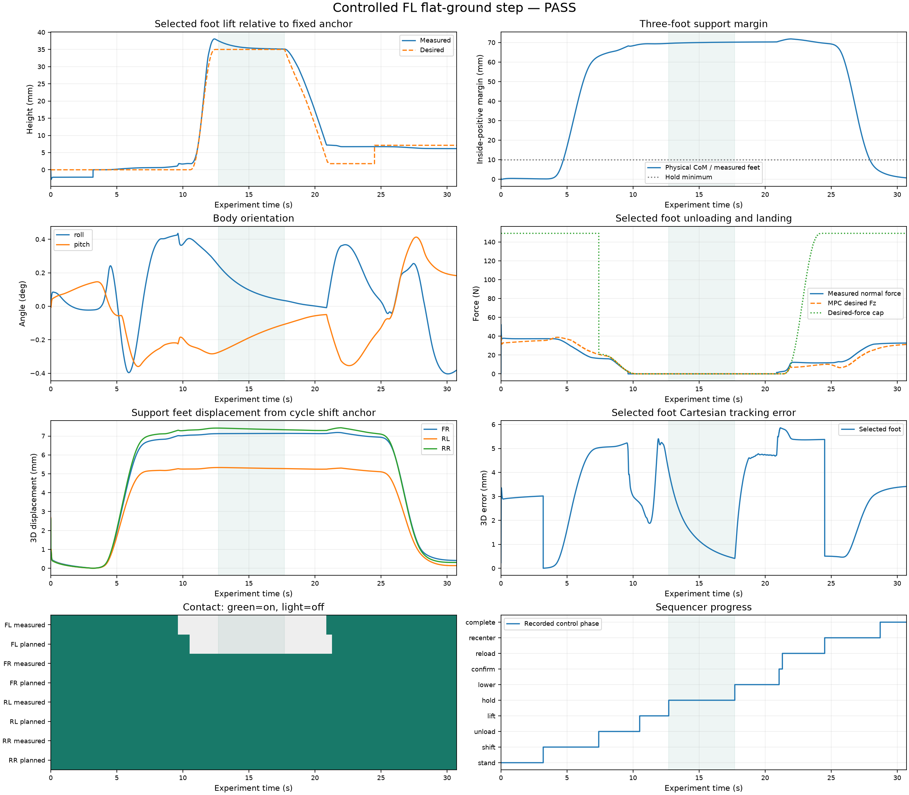

# Controlled FL foot step — PASS

Completed 1 of 1 requested cycles. Each commanded lift is 35 mm with a 5 s hold. Recorded 30.714 s at 0.002 s per interval.

Predeclared engineering limits for this controlled flat-ground simulation; not a stability proof.

| Check | Result | Requirement | Observed |
|---|---|---|---|
| completed | PASS | Completed status and exactly 1 completed cycles | {"status": "completed", "completed_cycles": 1} |
| cycle_labels | PASS | Every requested cycle appears in chronological order | [1] |
| sample_clock | PASS | Continuous end-of-interval sampling with no reset or time gap | {"rows": 15357, "last_time_s": 30.713999999993856} |
| control_alignment | PASS | Control timestamp equals interval endpoint minus dt | 1.1084883011491797e-15 |
| mpc_update_cadence | PASS | MPC updates match the configured fixed-step cadence, initialization, and immediate support changes; no missing or unexplained solves | {"configured_frequency_hz": 100.0, "effective_periodic_frequency_hz": 100.0, "period_in_physics_steps": 5, "step_sequence_valid": true, "expected_updates": 3074, "recorded_updates": 3074, "extra_support_change_updates": 2, "missing_periodic_updates": 0, "missing_support_change_updates": 0, "unexpected_updates": 0} |
| finite_data | PASS | All recorded numerical signals finite | [] |
| no_termination | PASS | No termination or truncation | 0 |
| no_numerical_warnings | PASS | No MuJoCo numerical warnings | 0.0 |
| no_torque_saturation | PASS | No actuator command clipping | 0 |
| qp_success | PASS | Every MPC update has QP status 0 | {"0": 3074} |
| nlp_status | PASS | Post-settling MPC NLP status is 0 or 2 | {"2": 2774} |
| selected_force_cap | PASS | Desired selected-foot vertical force <= configured cap + 1 N at MPC updates | 2.135751041437065e-11 |
| body_tilt | PASS | Maximum absolute roll or pitch < 8 degrees | 0.43570502247900955 |
| cycle_1_phase_order | PASS | All stages occur once in stand→shift→unload→lift→hold→lower→confirm→reload→recenter order | ["stand", "shift", "unload", "lift", "hold", "lower", "confirm", "reload", "recenter", "complete"] |
| cycle_1_hold_duration | PASS | Continuous hold >= 5 s with at most one sample of boundary tolerance | 5.0 |
| cycle_1_hold_contact | PASS | Selected foot has neither contact nor planned support; other three have both for every hold sample | {"selected_measured_samples": 0, "selected_planned_samples": 0, "missing_support_measured_samples": 0, "missing_support_planned_samples": 0} |
| cycle_1_swing_schedule | PASS | Selected planned support remains off and the other three remain on throughout lift/hold/lower/confirm | {"selected_planned_samples": 0, "missing_support_planned_samples": 0} |
| cycle_1_support_contact_continuity | PASS | All three support feet retain measured contact throughout unload/lift/hold/lower/confirm/reload | 0 |
| cycle_1_hold_clearance | PASS | Selected foot remains >= 20 mm above its fixed pre-lift center height throughout hold | 0.035123444209246395 |
| cycle_1_support_margin | PASS | Physical CoM projection has >= 10 mm margin inside measured three-foot support triangle during hold | {"independent_minimum_m": 0.06960009231035648, "logged_minimum_m": 0.06960009231035648} |
| cycle_1_fixed_lift_reference | PASS | Immutable lift anchor and constant hold target 0.035 m above it, with zero desired velocity/acceleration | true |
| cycle_1_foot_tracking | PASS | Selected-foot 3D error < 12 mm during lift, hold, lower and confirm | 0.005862564455773934 |
| cycle_1_support_slip | PASS | All three support feet stay within 10 mm of their fixed positions at shift entry | 0.00743684677598106 |
| cycle_1_lift_entry_guard | PASS | Last unload sample before lift: selected normal < 3 N, each support > 5 N, physical margin >= 20 mm, selected cap <= 0.1 N | {"last_unload_time_s": 10.504000000000177, "selected_normal_force_n": 0.0, "minimum_support_normal_force_n": 45.07142988585428, "physical_support_margin_m": 0.06906348433927874, "selected_force_cap_n": 0.0} |
| cycle_1_force_cap_ramps | PASS | Unload and reload each last >= 3 s; held MPC force cap decreases monotonically on unload and increases on reload | {"unload_duration_s": 3.1, "reload_duration_s": 3.202, "maximum_unload_cap_increase_n": 0.0, "maximum_reload_cap_decrease_n": -0.0} |
| cycle_1_reload_gate | PASS | Reload follows confirm and recorded dwell >= 0.1 s; preceding contacts independently active at >= 2 N for that debounce minus at most one boundary sample | {"time_s": 21.30799999999907, "contact_confirmed": true, "measured_contact": true, "dwell_s": 0.09999999999994458, "independent_debounce_samples": 49, "independent_debounce_duration_s": 0.098, "independent_debounce_min_normal_force_n": 2.316171655395596, "independent_debounce_passed": true} |
| cycle_1_reload_loading | PASS | All four feet have measured/planned contact and normal force > 5 N for the last 0.2 s of reload and first recenter sample | {"reload_dwell_s": 0.2, "first_recenter_time_s": 24.509999999997294, "minimum_normal_force_n_by_leg": {"FL": 11.673156605221338, "FR": 37.1717602094005, "RL": 40.18289316887514, "RR": 60.081863016261096}, "missing_measured_or_planned_contacts": 0} |
| final_four_foot_stance | PASS | Final complete phase lasts >= 1 s with all four feet in measured and planned contact | 2.004 |
| final_four_foot_loading | PASS | Every foot remains loaded above 5 N throughout the final complete phase (at least 1 s), with measured and planned contact | {"duration_s": 2.004, "minimum_normal_force_n_by_leg": {"FL": 32.04473204696113, "FR": 34.2317306837986, "RL": 40.072181787220046, "RR": 41.184399794800285}} |

| Cycle | Hold (s) | Min clearance (mm) | Min support margin (mm) | Max hold error (mm) | Max support drift (mm) |
|---|---:|---:|---:|---:|---:|
| 1 | 5.000 | 35.123 | 69.600 | 4.052 | 7.437 |

Phase durations and landing-force peaks for every cycle are in `step_summary.json`. Fixed anchors and the physical CoM support triangle provide evidence independent of the requested foot trajectory.

- **phase duration:** Sample count × dt; row labels describe the preceding control interval.
- **clearance:** Selected foot geometry-center height above recorded fixed pre-lift center; not absolute floor distance.
- **support margin:** Independently recomputed from physical CoM and the other three measured foot centers in world XY.
- **support displacement:** Foot geometry-center displacement from fixed per-cycle shift anchors includes rolling and contact compliance; it is not a measurement of pure tangential slip.
- **landing debounce:** Pre-reload sampled selected-foot contacts must remain active with normal force >= 2 N; one boundary sample is allowed for control-start versus observation-end alignment.
- **restored loading:** Each foot must exceed 5 N over the last 0.2 s of reload plus the first recenter sample, and throughout final standing; contact flags alone do not establish loading.
- **mpc cadence:** Periodic interval is round(1/(configured frequency × physics dt)), matching the controller. Initialization and support changes force solves; a support-change solve does not reset the periodic grid.
- **force cap:** Bounds the MPC desired vertical force at MPC updates, not the measured contact reaction.
- **force ramp duration:** The 3 s minimum for unload/reload is a declared check of this milestone's fixed controller schedule, not a universal dynamics requirement.
- **landing impact:** Peak simulated normal contact reaction in first 100 ms after contact; not a hardware impact measurement.
- **nlp status:** Status 2 denotes the configured SQP iteration limit; underlying QP status must remain zero.

Raw observations: `signals.npz`. Configuration/provenance: `metadata.json`.
