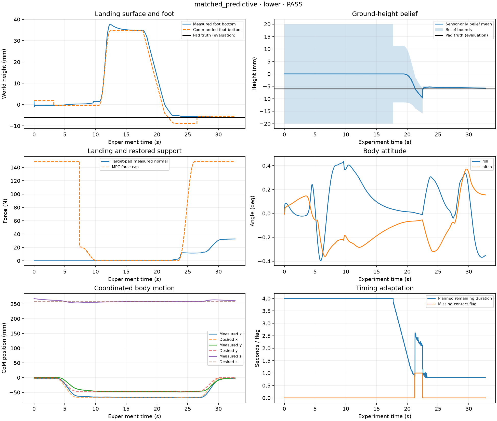

# Adjustable landing pad — PASS

Planner: **matched_predictive**. Role: **evaluation**. Height condition: **lower**.

| Metric | Value |
|---|---:|
| sample_count | 16353 |
| duration_s | 32.705999999994006 |
| mpc_updates | 3272 |
| maximum_abs_roll_pitch_deg | 0.43570502247900955 |
| maximum_abs_actuator_torque_nm | 11.952678662311477 |
| final_complete_duration_s | 2.0020000000000002 |
| maximum_logged_vs_independent_margin_difference_m | 0.0 |
| fallback_active_time_s | 0.0 |
| fallback_commanded_foot_descent_m | 0.0 |
| fallback_commanded_com_travel_m | 0.0 |
| fallback_active_plan_count | 0 |
| minimum_unsupported_remaining_time_s | 0.8073218834574653 |
| minimum_raw_model_remaining_time_s | 0.8073218834574653 |
| learned_prior_active_plan_count | 0 |
| learned_prior_active_plan_fraction | 0.0 |
| missing_contact_planning_updates | 25 |
| recovery_planning_updates | 63 |
| minimum_raw_recovery_remaining_time_s | 0.8073218834574653 |
| lowering_initial_measured_foot_bottom_m | 0.035153927105356676 |
| lowering_initial_measured_com_w | [-0.06750637895500429, -0.04761472497170049, 0.25856186650364643] |
| success | True |
| completion_time_s | 32.705999999994006 |
| lowering_to_touchdown_s | 4.7479999999973685 |
| lowering_to_completion_s | 15.00199999999294 |
| first_target_touchdown_time_s | 22.451999999998435 |
| nominal_touchdown_deadline_s | 21.704000000001066 |
| touchdown_minus_nominal_deadline_s | 0.7479999999973685 |
| observed_contact_timing | late |
| missing_contact_observed | True |
| first_missing_contact_time_s | 21.207999999999124 |
| missing_contact_before_physical_touchdown | True |
| recovery_to_touchdown_s | 1.2439999999993105 |
| peak_normal_force_first_100ms_n | 1.1352943432933533 |
| normal_impulse_first_100ms_ns | 0.10189591462477307 |
| maximum_roll_pitch_change_during_landing_deg | 0.47812163090447857 |
| maximum_com_reference_error_during_landing_m | 0.015062605383152102 |
| maximum_body_rotation_during_landing_deg | 0.9970096413386108 |
| height_belief_final_error_m | 0.0002845940838208001 |
| height_belief_error_at_contact_confirmation_m | 0.0006622641997730255 |
| planner_update_count | 134 |
| planner_mean_compute_time_s | 0.0029278604178718743 |
| planner_maximum_compute_time_s | 0.04832638900006714 |
| reference_projection_count | 0.0 |
| planner_fallback_count | 0.0 |
| learned_conditioning_updates | 0.0 |
| learned_duration_min_s | None |
| learned_duration_max_s | None |
| predictive_optimization_failures | 0.0 |

| Check | Result | Observed |
|---|---|---|
| completed | PASS | {"status": "completed", "completed_cycles": 1} |
| cycle_labels | PASS | [1] |
| sample_clock | PASS | {"rows": 16353, "last_time_s": 32.705999999994006} |
| control_alignment | PASS | 2.444225377651321e-15 |
| mpc_update_cadence | PASS | {"configured_frequency_hz": 100.0, "effective_periodic_frequency_hz": 100.0, "period_in_physics_steps": 5, "step_sequence_valid": true, "expected_updates": 3272, "recorded_updates": 3272, "extra_support_change_updates": 1, "missing_periodic_updates": 0, "missing_support_change_updates": 0, "unexpected_updates": 0} |
| finite_data | PASS | [] |
| no_termination | PASS | 0 |
| no_numerical_warnings | PASS | 0.0 |
| no_torque_saturation | PASS | 0 |
| qp_success | PASS | {"0": 3272} |
| nlp_status | PASS | {"2": 2972} |
| selected_force_cap | PASS | 2.135366441693923e-11 |
| body_tilt | PASS | 0.43570502247900955 |
| cycle_1_phase_order | PASS | ["stand", "shift", "unload", "lift", "hold", "lower", "confirm", "reload", "recenter", "complete"] |
| cycle_1_hold_duration | PASS | 5.0 |
| cycle_1_hold_contact | PASS | {"selected_measured_samples": 0, "selected_planned_samples": 0, "missing_support_measured_samples": 0, "missing_support_planned_samples": 0} |
| cycle_1_swing_schedule | PASS | {"selected_planned_samples": 0, "missing_support_planned_samples": 0} |
| cycle_1_support_contact_continuity | PASS | 0 |
| cycle_1_hold_clearance | PASS | 0.035123444209246395 |
| cycle_1_support_margin | PASS | {"independent_minimum_m": 0.06960009231035648, "logged_minimum_m": 0.06960009231035648} |
| cycle_1_fixed_lift_reference | PASS | true |
| cycle_1_foot_tracking | PASS | 0.005403830396034053 |
| cycle_1_support_slip | PASS | 0.007523989485491823 |
| cycle_1_lift_entry_guard | PASS | {"last_unload_time_s": 10.504000000000177, "selected_normal_force_n": 0.0, "minimum_support_normal_force_n": 45.07142988585428, "physical_support_margin_m": 0.06906348433927874, "selected_force_cap_n": 0.0} |
| cycle_1_force_cap_ramps | PASS | {"unload_duration_s": 3.1, "reload_duration_s": 3.202, "maximum_unload_cap_increase_n": 0.0, "maximum_reload_cap_decrease_n": -0.0} |
| cycle_1_reload_gate | PASS | {"time_s": 23.301999999997964, "contact_confirmed": true, "measured_contact": true, "dwell_s": 0.09999999999994458, "independent_debounce_samples": 49, "independent_debounce_duration_s": 0.098, "independent_debounce_min_normal_force_n": 2.3287583940938075, "independent_debounce_passed": true} |
| cycle_1_reload_loading | PASS | {"reload_dwell_s": 0.2, "first_recenter_time_s": 26.50399999999619, "minimum_normal_force_n_by_leg": {"FL": 11.61951698954783, "FR": 37.07370487555539, "RL": 40.24545082530731, "RR": 60.18081689639461}, "missing_measured_or_planned_contacts": 0} |
| final_four_foot_stance | PASS | 2.0020000000000002 |
| final_four_foot_loading | PASS | {"duration_s": 2.0020000000000002, "minimum_normal_force_n_by_leg": {"FL": 32.03256650531527, "FR": 34.19508046028367, "RL": 40.02325951560774, "RR": 41.25419726746386}} |
| pad_reference_limit_configuration | PASS | {"max_foot_speed_m_s": 0.015, "search_speed_m_s": 0.005, "max_com_speed_m_s": 0.008, "max_body_displacement_m": 0.012, "target_xy_tolerance_m": 0.005, "max_orientation_deviation_rad": 0.03490658503988659, "max_orientation_rate_rad_s": 0.02} |
| pad_finite_planner_signals | PASS | null |
| pad_commanded_foot_speed | PASS | {"maximum_m_s": 0.011256952172605104, "limit_m_s": 0.015} |
| pad_commanded_com_speed | PASS | {"maximum_m_s": 0.0011930455202511696, "limit_m_s": 0.008} |
| pad_monotone_lowering | PASS | {"maximum_upward_speed_m_s": 0.0} |
| pad_commanded_body_displacement | PASS | {"maximum_m": 0.0015060032271163037, "limit_m": 0.012} |
| pad_commanded_target_xy | PASS | {"maximum_coordinate_error_m": 0.0, "limit_m": 0.005} |
| pad_commanded_orientation | PASS | {"maximum_deviation_rad": 0.0, "maximum_rate_rad_s": 0.0} |
| pad_contact_reference_freeze | PASS | {"maximum_foot_speed_m_s": 0.0, "maximum_com_speed_m_s": 0.0} |
| pad_planner_update_cadence | PASS | {"frequency_hz": 20.0, "period_steps": 25, "missing_updates": 0, "unexpected_updates": 0} |
| pad_commanded_recovery_speed | PASS | {"checked_intervals": 600, "maximum_m_s": 0.0036094708384716797, "limit_m_s": 0.005} |
| pad_adaptation_signals | PASS | [] |
| pad_adaptation_alignment | PASS | null |
| pad_positive_remaining_duration | PASS | {"planner_remaining_time_s": 0.8073218834574653, "optimized_remaining_time_s": 0.8073218834574653, "feasible_remaining_time_s": 0.8073218834574653} |
| pad_current_state_replanning | PASS | null |
| pad_fallback_prior_exclusion | PASS | null |
| pad_prior_execution | PASS | false |
| pad_fallback_work_accounting | PASS | {"active_time_s": 0.0, "foot_descent_m": 0.0, "com_travel_m": 0.0} |
| pad_noncontact_ablation_configuration | PASS | false |
| pad_configuration | PASS | {"experiment": "landing_pad", "cycles": 1, "max_search_depth_m": 0.02, "contact_compression_m": 0.004} |
| pad_fixed_support_surfaces | PASS | [0.0, 0.0, 0.0, 0.0] |
| pad_truth_separation_schema | PASS | [] |
| pad_bounded_descent | PASS | {"minimum_commanded_bottom_m": -0.008927137878157685, "minimum_allowed_bottom_m": -0.024} |
| pad_physical_reach | PASS | {"minimum_actual_bottom_m": -0.006149553915063312, "minimum_allowed_bottom_m": -0.04} |
| pad_foot_bottom_consistency | PASS | 0.0 |
| pad_target_force_consistency | PASS | {"maximum_target_force_n": 32.684477074533326, "maximum_target_minus_total_normal_n": 0.0} |
| pad_final_target_loading | PASS | {"minimum_normal_force_n": 32.03256650531527, "maximum_xy_target_error_m": 0.0022314509058124488, "missing_target_contact_samples": 0} |
| pad_final_height_consistency | PASS | 0.00014955391506331177 |
| pad_target_contact_before_reload | PASS | {"required_samples": 49, "first_reload_time_s": 23.301999999997964} |
| pad_target_reload_loading | PASS | 11.61951698954783 |
| pad_belief_bounds | PASS | null |
| pad_sensor_causality | PASS | {"maximum_future_lead_s": 0.0} |
| pad_planner_execution | PASS | {"updates": 134, "maximum_fallback_count": 0.0} |

- **impact:** Simulated target-pad normal reaction over exactly 100 ms after first physical target contact; impulse is the rectangle-rule integral, including static load.
- **body_disturbance:** Roll/pitch change from lowering entry and CoM tracking error are reported separately from intentionally commanded body motion.
- **timing:** Physical contact time uses post-step evaluation contacts. Nominal deadline is lowering entry plus requested nominal duration; approximately planned means within 0.25 s. This descriptive label is not an acceptance criterion.
- **height_truth:** Actual height is used only by the simulator and this evaluator. Schema checks do not prove absence of arbitrary numeric information leaks; planner API tests and code review complement them.
- **completion:** All inherited controlled-step criteria and additional pad checks must pass. No relative planner superiority is assumed.

Full requirements and metrics: `pad_summary.json`. Core execution checks: `step_report.md`. Measurements: `signals.npz`; simulator-only truth: `metadata.json` → `evaluation`.
